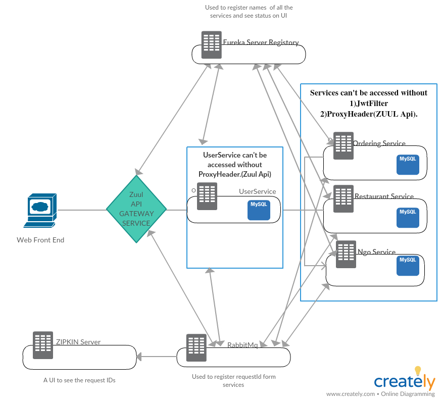
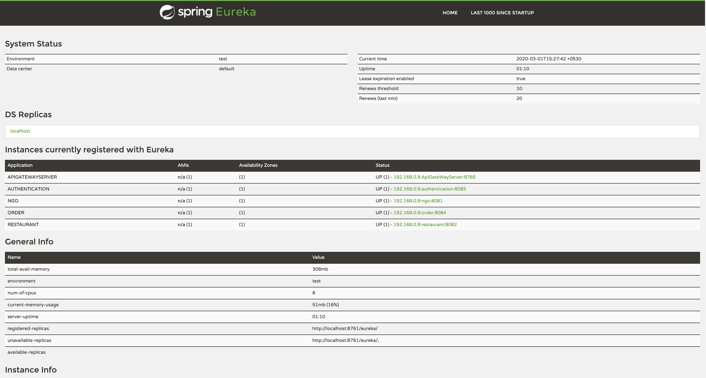
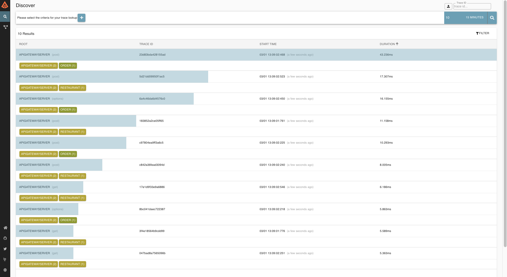
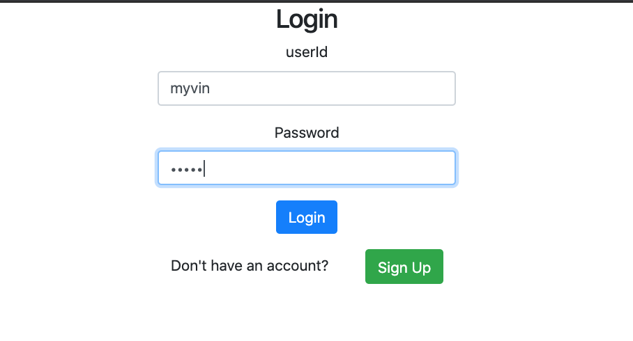
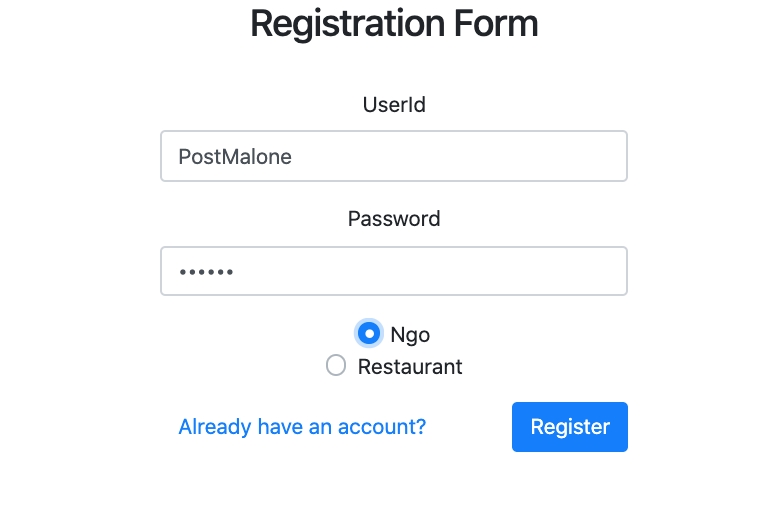
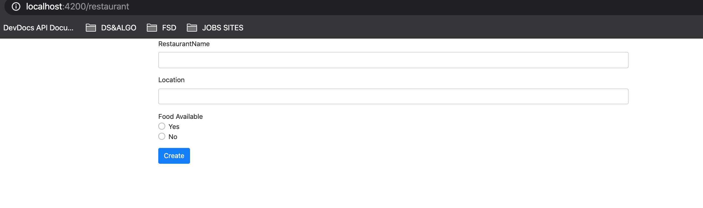
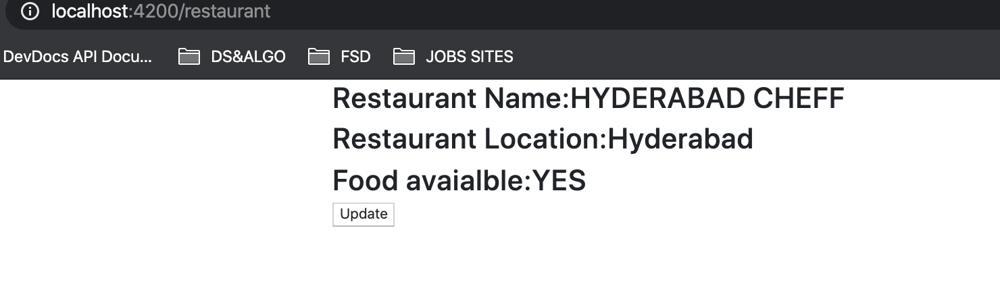
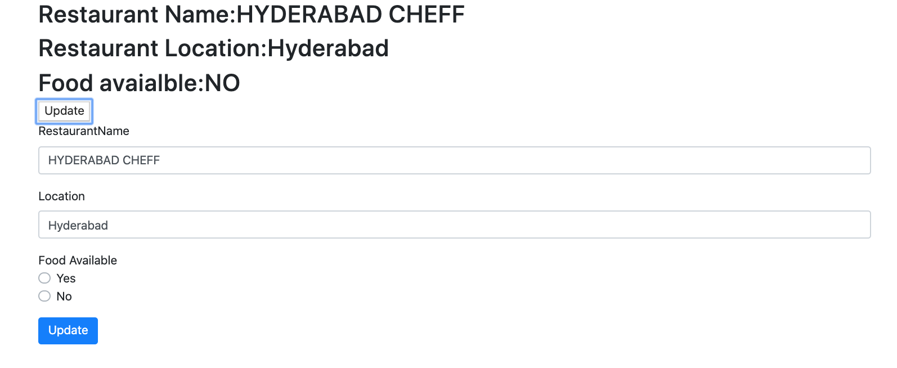
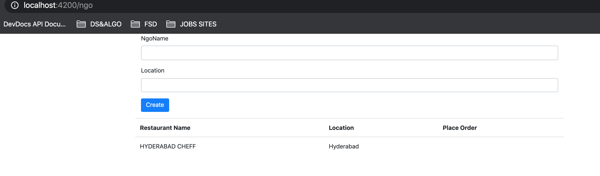
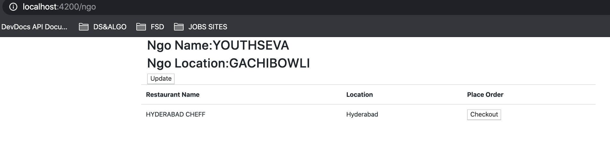

# NgoApp  
An Ngo app to see the excess food left in restaurants and book it for their Ngo.

# Desgin 
  

# Commands
  RABBIT_URI=amqp://localhost java -jar zipkin.jar |command to connect rabbitmq with zipkins server  
  Also adding the following dependencies in all the servers 
  		<dependency>  
			<groupId>org.springframework.cloud</groupId>  
			<artifactId>spring-cloud-sleuth-zipkin</artifactId>  
			<version>2.1.1.RELEASE</version>  
		</dependency>  
		<dependency>  
			<groupId>org.springframework.cloud</groupId>  
			<artifactId>spring-cloud-starter-bus-amqp</artifactId>  
		</dependency>  
   
    
    
    

# ScreenShots
  ## Eureka  
  
  ## Zipkin
   
  ## User Screen
  
   
  
  
  
  
  
  
   
